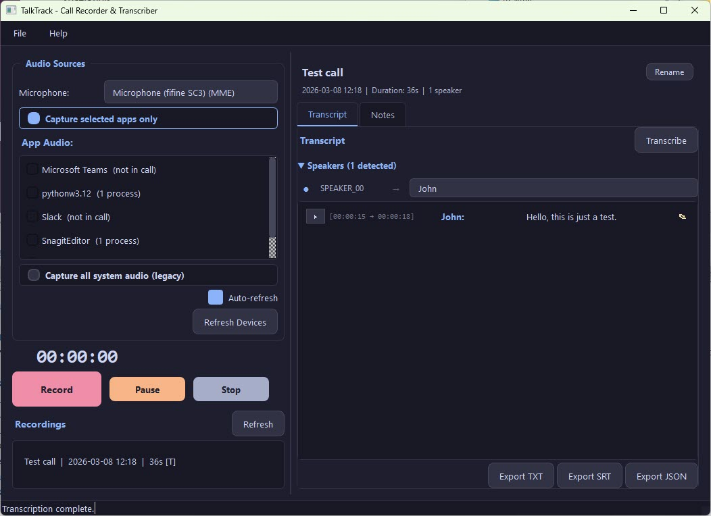

# TalkTrack

Record, transcribe, and identify speakers from your calls — all locally on your machine. Free and open-source alternative to Evaer, Otter.ai, and Fireflies.

TalkTrack is a Windows desktop app for **recording and transcribing Microsoft Teams calls, Zoom meetings, Google Meet sessions**, and any other audio app. It uses [Faster Whisper](https://github.com/SYSTRAN/faster-whisper) for local speech-to-text and [pyannote.audio](https://github.com/pyannote/pyannote-audio) for speaker identification. Everything runs offline — no cloud services, no subscriptions, no data leaves your PC.


[](https://buymeacoffee.com/obscureaintsecure)



## Why TalkTrack?

- **No cloud uploads** — your meeting recordings and transcripts stay on your machine
- **No subscriptions** — free and open-source, no monthly fees like Otter.ai or Fireflies
- **Works with any app** — Microsoft Teams, Zoom, Google Meet, Discord, Slack huddles, WebEx, or any app that plays audio
- **Per-app capture** — on Windows 11, record only your call app without picking up Spotify or YouTube in the background
- **AI-powered** — state-of-the-art Whisper speech recognition + pyannote speaker diarization, running locally on your hardware

## Features

- **Record calls** with Record / Pause / Resume / Stop controls and a live timer
- **Per-app audio capture** (Windows 11) — pick specific apps like Teams or Chrome
- **System audio capture** (Windows 10+) — WASAPI loopback for all system audio
- **Dual-channel recording** — microphone + system/app audio captured separately
- **Local transcription** — Faster Whisper (OpenAI Whisper), no internet required
- **Speaker diarization** — two modes:
  - *Simple* (no setup): labels "You" vs "Remote" from mic vs system channels
  - *Full* (pyannote.audio): identifies individual speakers with a free HuggingFace token
- **Interactive transcript** — click any segment to replay its audio, edit text inline, assign speaker names
- **Export** to TXT, SRT (subtitles), or JSON
- **Call notes** with timestamp insertion
- **Recording browser** — browse and replay past recordings
- **Dark theme** UI (Catppuccin Mocha palette)
- **Guided setup wizard** for HuggingFace / pyannote configuration

## Quick Start

### Prerequisites

- Windows 10 or 11
- Python 3.10+
- A microphone

### Install

```bash
git clone https://github.com/ObscureAintSecure/TalkTrack.git
cd TalkTrack
pip install -r requirements.txt
```

### Run

Double-click **`start.bat`**, or:

```bash
python main.py
```

### Speaker Diarization (Optional)

For multi-speaker identification (speaker 1, speaker 2, etc...), TalkTrack uses pyannote.audio which requires a free HuggingFace account. On first launch, a setup wizard walks you through the steps:

1. Create a free account at [huggingface.co](https://huggingface.co/join)
2. Accept the model license at [pyannote/speaker-diarization-community-1](https://huggingface.co/pyannote/speaker-diarization-community-1)
3. Create an access token at [huggingface.co/settings/tokens](https://huggingface.co/settings/tokens)
4. Paste the token into the wizard (or Settings > Transcription)

Without this setup, TalkTrack still works — it just labels speakers as "You" and "Remote" based on audio channels.

## Usage

1. Start your call in Teams, Zoom, or any app
2. In TalkTrack, select your microphone and the app to capture
3. Click **Record**
4. When done, click **Stop** — transcription starts automatically
5. Review the transcript, assign speaker names, edit text, export

**Windows 11:** Select specific apps (Teams, Chrome, etc.) in the app picker to capture only their audio.

**Windows 10:** Captures all system audio via WASAPI loopback.

## How Transcription Works

TalkTrack uses [Faster Whisper](https://github.com/SYSTRAN/faster-whisper), a CTranslate2-optimized version of OpenAI's Whisper model. Everything runs locally — no audio is sent to any server.

### Pipeline

1. **Recording** — Audio is captured as dual tracks: your microphone and system/app audio. Both are saved as WAV files alongside a `combined_audio.wav` used for transcription.
2. **Transcription** — When recording stops, Faster Whisper processes `combined_audio.wav` and produces timestamped text segments. VAD (Voice Activity Detection) filtering skips silence automatically.
3. **Speaker Diarization** — Speakers are identified and labeled on each segment (see below).
4. **Review** — The interactive transcript viewer lets you play back individual segments, edit text inline, and assign friendly names to speakers. Changes are saved to `transcript.json` and `speaker_names.json` in the recording directory.

### Whisper Models

Choose a model in **Settings > Transcription** based on your speed/accuracy needs:

| Model | Size | Speed | Accuracy | VRAM (GPU) |
|-------|------|-------|----------|------------|
| `tiny` | ~75 MB | Fastest | Basic | ~1 GB |
| `base` | ~145 MB | Fast | Good | ~1 GB |
| `small` | ~480 MB | Moderate | Better | ~2 GB |
| `medium` | ~1.5 GB | Slow | Great | ~5 GB |
| `large-v3` | ~3 GB | Slowest | Best | ~10 GB |

Models are downloaded automatically on first use and cached locally. No internet is needed after the initial download.

### CPU vs GPU

- **CPU** (`int8` quantization) — works on any machine, no extra setup. Good enough for most use cases.
- **CUDA** (`float16`) — significantly faster if you have an NVIDIA GPU with CUDA installed. Select "CUDA (NVIDIA GPU)" in Settings > Transcription > Compute Device.

### Language

By default, Whisper auto-detects the spoken language. You can set a specific language in Settings > Transcription > Language (e.g., `en`, `es`, `de`) to improve accuracy and speed if you know what language will be spoken.

## Speaker Diarization

Speaker diarization identifies *who* is speaking at each point in the transcript. TalkTrack offers two modes:

### Simple Mode (No Setup)

Works out of the box. Compares audio energy between your microphone track and the system/app audio track to label each segment as **"You"** or **"Remote"**. Best for 1-on-1 calls.

### Full Diarization (pyannote.audio)

Uses the [pyannote.audio](https://github.com/pyannote/pyannote-audio) neural pipeline to identify individual speakers (SPEAKER_00, SPEAKER_01, etc.). Works for any number of participants. Requires a free HuggingFace account — see [Speaker Diarization setup](#speaker-diarization-optional) above.

You can optionally set min/max speaker counts in Settings to help the model when you know how many people are on the call.

After diarization, use the **Speaker Name Panel** in the transcript viewer to map generic labels (SPEAKER_00) to real names. Names are saved per recording and included in exports.

## Export Formats

| Format | Description |
|--------|-------------|
| **TXT** | Plain text with timestamps and speaker labels |
| **SRT** | Subtitle format, compatible with video players |
| **JSON** | Structured data with all segment metadata |

All exports include speaker names if assigned.

## Settings

Access via the gear icon or **Edit > Settings**:

| Setting | Options | Default |
|---------|---------|---------|
| Whisper Model | tiny, base, small, medium, large-v3 | small |
| Compute Device | CPU, CUDA (NVIDIA GPU) | CPU |
| Language | Auto-detect, or specify (en, es, etc.) | Auto-detect |
| Sample Rate | 16000, 22050, 44100, 48000 Hz | 16000 |
| Output Format | WAV, MP3 (requires FFmpeg) | WAV |
| Capture Mode | Per-app (Win11) or Legacy | Auto-detected |
| Diarization | Enabled/Disabled, min/max speakers | Disabled |

## Project Structure

```
TalkTrack/
  main.py                    # Entry point
  start.bat / start.ps1      # Launcher scripts
  requirements.txt           # Dependencies
  resources/style.qss        # Dark theme stylesheet
  app/
    main_window.py           # Main window + orchestration
    audio/
      segment_player.py      # Audio clip playback
    recording/
      audio_capture.py       # WASAPI capture (legacy + per-app)
      process_audio_capture.py  # Win11 per-process capture
      recorder.py            # Recording state machine
    transcription/
      transcriber.py         # Faster Whisper integration
      diarizer.py            # Speaker diarization (pyannote)
    ui/                      # All UI components
    utils/                   # Config, device enumeration, helpers
  tests/                     # Unit tests
  recordings/                # Output directory
```

## Running Tests

```bash
python -m pytest tests/ -v
```

## Tech Stack

| Component | Library |
|-----------|---------|
| GUI | PyQt6 |
| Audio Capture | sounddevice, WASAPI, comtypes |
| Transcription | faster-whisper |
| Speaker Diarization | pyannote.audio 4.0 |
| Deep Learning | PyTorch |
| Audio Processing | scipy, pydub, soundfile, numpy |
| Windows Integration | pywin32, pycaw, comtypes |

## Use Cases

- **Meeting minutes** — Record your Teams or Zoom meetings and get searchable, timestamped transcripts
- **Interview recording** — Capture job interviews or user research calls with speaker labels
- **Lecture capture** — Record online lectures or webinars for later review
- **Podcast recording** — Record remote podcast guests from Discord or Zoom with per-speaker transcripts
- **Compliance & documentation** — Keep records of client calls with exportable transcripts
- **Accessibility** — Generate subtitles (SRT) from any recorded call for hearing-impaired participants

## Known Limitations

- **Windows only** — uses WASAPI and Windows COM APIs
- **Per-app capture requires Windows 11** Build 22000+
- Per-process COM capture is in active development — the pipeline structure is in place, with packet reading being completed through real-device testing
